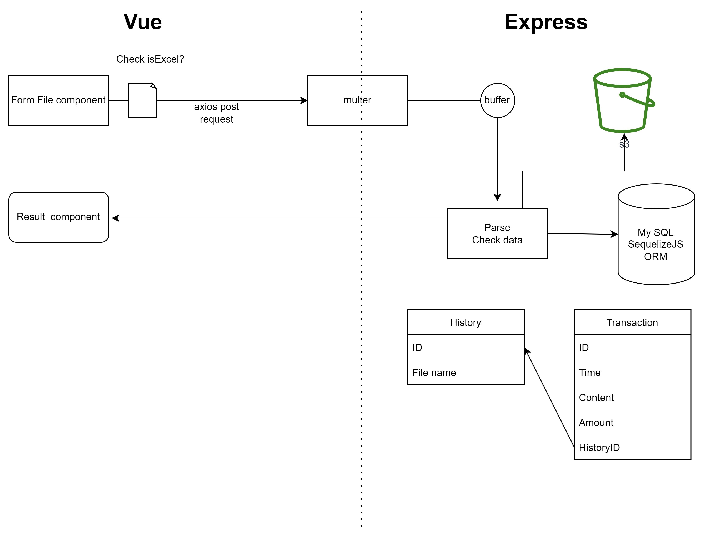

# ExcelUpload Backend 
Demo link: http://exceluploadbackend-env.eba-ytcdwvkr.ap-southeast-1.elasticbeanstalk.com/transaction/history


## Technology

- ExpressJS
- MySQL with SequelizeJS ORM 
- Deploy: AWS Elastic Beanstalk with Amazon RDS

## Usage

Clone it!

```
$ git clone git@github.com/tindinhct93/expressBackend.git
```

Go into the project directory and run the command:

```
$ node app.js
```

Create the MySQL Database, migrate it: 

```
http://localhost:5000/sync
```

Open `http://localhost:5000` and enjoy!

## App workflow:


